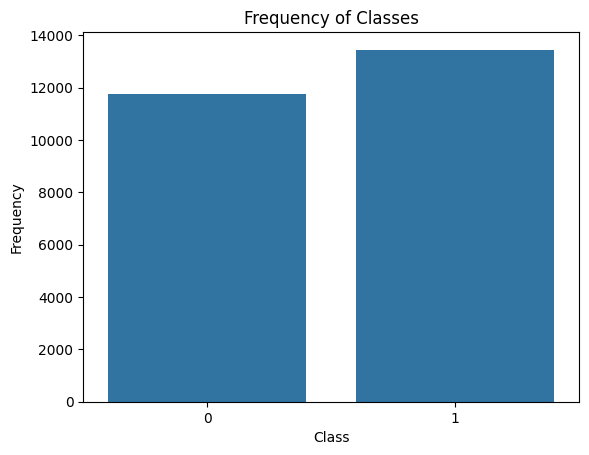
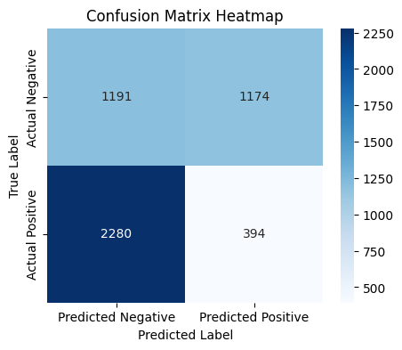

# 🔐 Network Intrusion Detection System

## Overview

This project implements a Deep Learning-based Network Intrusion Detection System (NIDS) for identifying malicious network activities and cyber attacks from network traffic data.

The system analyzes network traffic patterns and classifies them as either normal or intrusive, helping improve cybersecurity monitoring and threat detection.

---

## Dataset

Dataset Source:

https://www.kaggle.com/datasets/sampadab17/network-intrusion-detection

The dataset contains network traffic records with multiple features representing network behavior and attack patterns.

---

## Technologies Used

- Python
- Pandas
- NumPy
- Scikit-Learn
- TensorFlow
- Keras
- Matplotlib
- Seaborn
- Jupyter Notebook

---

## Project Workflow

1. Data Preprocessing
2. Feature Engineering
3. Data Encoding
4. Model Development
5. Model Training
6. Performance Evaluation
7. Intrusion Classification

---

## My Contributions

- Data preprocessing and cleaning
- Feature engineering
- Deep learning model development
- Optimizer comparison and evaluation
- Performance visualization
- Repository documentation

---

## Results

The project evaluates multiple optimizers including:

- Adam
- RMSProp
- Adagrad
- Adadelta
- FTRL
- SGD
- Adamax
- Nadam

The best-performing models achieved approximately 99% accuracy on the test dataset.

---

## Visualizations

### Dataset Distribution



### Confusion Matrix



### Optimizer Performance Comparison


---

## Project Structure

```text
Network-Intrusion-Detection-System
│
├── images
│   ├── class_distribution.png
│   ├── confusion_matrix.png
│   └── model_accuracy_comparison.png
│
├── notebooks
│   └── Network_Intrusion_Detection.ipynb
│
├── results
│   └── README.md
│
├── requirements.txt
│
└── README.md
```

---

## Installation

```bash
git clone <repository-url>
cd Network-Intrusion-Detection-System
pip install -r requirements.txt
```

---

## Run the Project

Open the notebook:

```bash
jupyter notebook
```

and run:

```text
Network_Intrusion_Detection.ipynb
```

---

## Future Improvements

- Real-time intrusion detection
- Model deployment using Flask or FastAPI
- Cloud-based monitoring
- Advanced deep learning architectures

---

## Author

Kadari Tharani

AI & Machine Learning Engineering Student
